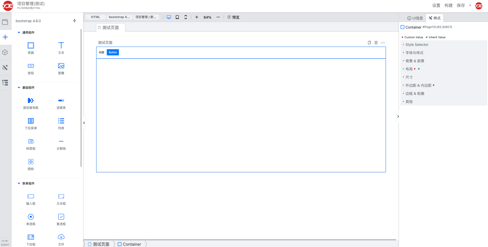
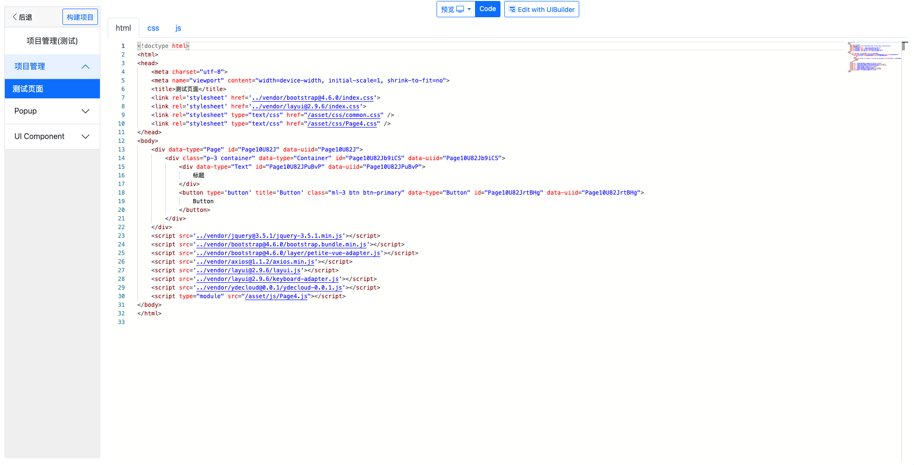
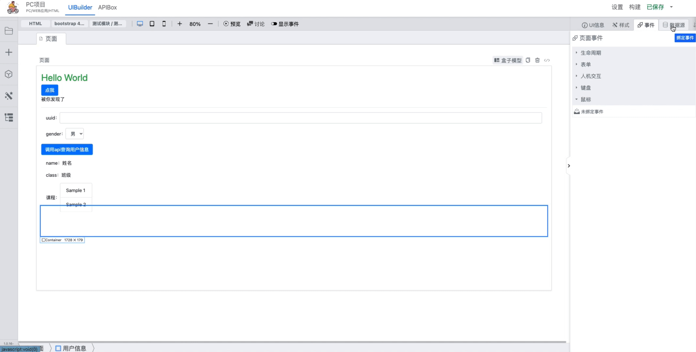
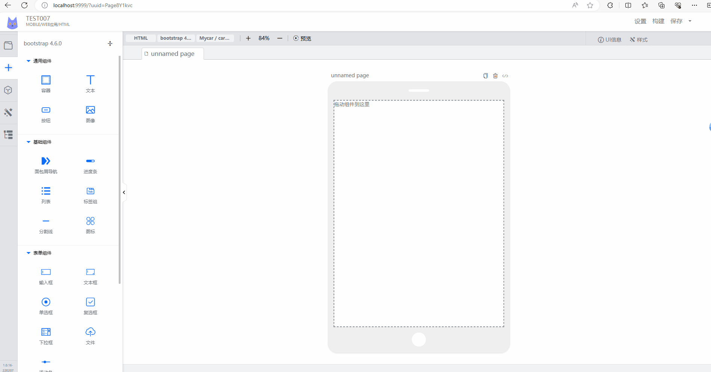
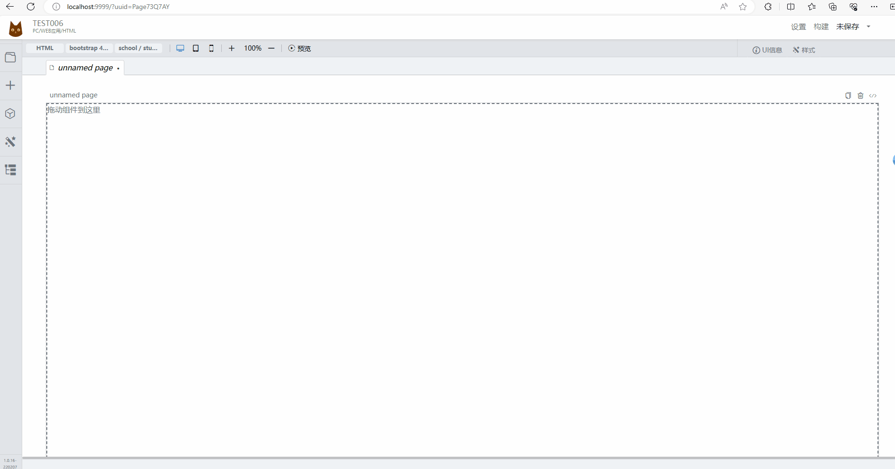
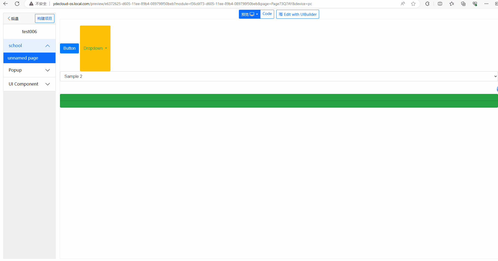

# YDUIBuilder

从业20载，从当初的兴奋，到最后的麻木，甚至怀疑：
_程序员是不是就是在不断的学习各种技术，
然后做着同样的重复劳动（体力劳动），在各种业务系统上用各种技术做同样的增删改查_。
对的，不管说着多牛逼的技术术语，做多高大上的软件，本质上就是**增删改查**，
并且充斥着大量重复的**模板代码**。抽象一下，不考虑技术，不考虑业务，他们是不是都一样的呢。

那么有没有一种可能，能帮助我们减少这些模板代码？
AI？低代码开发工具？

YDUIBuilder是另一种尝试，一种探索，
上学时老师告诉我们：程序 = 数据结构 + 算法；
从业多年的经验告诉我：软件 = UI + 数据 + 业务逻辑。
不管是前后端分离开发还是全栈开发，技术人员都在UI和数据上花了最多的时间，YDUIBuilder尝试
通过可视化的方式来减少这部分的重复工作量，并尽可能的重用，比如我们可以把软件看着是由**开发框架** + **UI框架**组成的。

其中开发框架决定软件的代码怎么组成，比如VUE，React，ios，android，小程序，原生H5，鸿蒙等；
UI框架定义人机交互等界面，比如Bootstrap，Vant。
在YDUIBuilder上，我们尝试让代码在这些框架间一键迁移成为可能。

## 主体框架开发计划
|      UI+框架       | UIBuilder | 预览器 | 编译器 |
|:----------------:|:---------:|:---:|:----:|
|  Bootstrap + H5  |✅ | ✅ |✅ |
| Bootstrap + Vue3 | ✅ |   ⌛  |   ⌛   |
|   Vant + Vue3    |  ✅     |   ⌛  |   ⌛   |
|   Vant + 微信小程序   |    ✅     |  ⌛   |    ⌛  |
|   Weui + 微信小程序   |   ✅     |  ⌛   |    ⌛  |
|    Layui + H5    |    ✅     |  ⌛   |   ⌛   |
|   Layui + Vue3   |   ✅     | ⌛    | ⌛     |

## 更新日志
1. 20240611 本次更新后不光只是做界面，还可以编译出功能代码，加入了数据和事件，数据可与UI进行绑定，可做完整的人机交互功能（数据的获取，接口的调用，响应数据的展示），事件及代码目前只支持HTML+Bootstrap。**本次更新未做数据库自动升级，需要删除原来的数据库后重新执行db_init.sql文件**
   1. 前端交互事件
   2. 前端UI绑定数据的输入（展示数据）和输出（为数据赋值）
   3. API调用：可视化设置API的请求和相应处理
   4. UI支持伪类定义
   5. UI State：通过数据来决定UI的样式
   6. 新增YDAPIBuilder项目，管理API的输入和输出
   7. 支持UI 组件，UI组件可自定义事件
2. 20240325 增加vue的支持
3. 20240314 增加微信小程序的支持

## 项目组成

1. 下载的代码包含四个项目目录：ydevcloud，yduibuilder，snapshot，ydapibuilder
2. ydevcloud： 管理后端：
   1. 项目管理
   2. 编译生成UI代码
3. yduibuilder： 开发前端，拖拽式生成界面和设置属性
4. snapshot： 页面截屏工具 （可选）
5. ydevcloud/code/cli：socket服务，用于编译打包生成代码 （可选）
6. ydapibuilder：API管理工具，管理接口信息

## 安装

### 准备
1. 本地需要安装php 7.4+环境并安装swoole、openssl、zip、xml、gd2，json，iconv扩展，
2. 安装mysql或者mariadb数据库
3. windows上php需要配置系统环境，以便在命令行能访问php.exe
4. 安装rabbitmq（可选，如果要生成页面截屏则安装）

### 安装yduibuilder
1. 这是一个vue3项目，用你的开发工具打开项目`yduibuilder`
2. 打开 src/lib/ydhl.ts，配置如下信息
   1. `api` 就是ydecloud管理后端的访问域名，也就是《安装ydecloud 管理后端》中的SITE_URI
   2. `uploadApi`就是《安装ydecloud 管理后端》中的UPLOAD_SITE_URI
   3. `socket`就是《安装ydecloud 管理后端》中的SOCKET_HOST
3. 进入到yduibuilder/yduibuilder目录后：`npm i --legacy-peer-deps`
4. 进入到yduibuilder/yduibuilder目录后：`npm run serve`
5. 默认情况 yduibuilder运行在9999端口上，如果有冲突，就修改package.json文件中scripts的对应设置，并修改《安装ydecloud 管理后端》中的UI_BUILDER_URI
6. yduibuilder不要直接访问，他是通过后端ydecloud进入

### 安装ydecloud 管理后端
1. 初始化数据库: 导入`db_init.sql`创建数据库
2. 修改`ydevcloud/code/app/__config__.php`中的配置, 在config方法中配置数据库信息
   1. `default_db`： 你的数据库名称
   2. `db_host`： 访问地址
   3. `db_user`: 用户名
   4. `db_port`： 访问端口
   5. `db_psw`： 密码
   6. `SITE_URI`： 为你本地设置的虚拟域名
   7. `UPLOAD_SITE_URI`： 为上传文件的访问域名，该演示环境上传的文件都放到upload下，所以就是你的域名加 `upload/`
   8. `UI_BUILDER_URI`： yduibuilder前端的访问地址，如果没有端口冲突，则不用做更改
   9. `API_BUILDER_URI`： ydapibuilder前端的访问地址，如果没有端口冲突，则不用做更改
   9. `SOCKET_HOST`： socket后端的地址，如果没有端口冲突，则不用做更改
   10. RABBITMQ_HOST，RABBITMQ_PORT，RABBITMQ_USER，RABBITMQ_PWD：为rabbitmq的访问信息，根据本地部署情况填写
3. 配置管理后端的访问域名；管理后端基于yangzie php开发框架开发，单入口模式，需要配置一个虚拟域名，指向工作目录`ydevcloud/code/app/public_html`
4. 访问你配置的虚拟域名，如果能看到如下界面，则说明配置成功
5. 点击使用则直接使用，无需登录
6. 安装composer包：`composer install`
6. 访问你的域名，剩下的自己探索吧

### 安装ydapibuilder
1. 这是一个vue3项目，用你的开发工具打开项目`ydapibuilder`
2. 打开 src/lib/ydhl.ts，配置如下信息
   1. `api` 就是ydecloud管理后端的访问域名，也就是《安装ydecloud 管理后端》中的SITE_URI
   2. `apiBuilder`就是自己等访问路径
   3. `socket`就是《安装ydecloud 管理后端》中的SOCKET_HOST
3. 进入到ydapibuilder/ydapibuilder目录后：`npm i --legacy-peer-deps`
4. 进入到ydapibuilder/ydapibuilder目录后：`npm run serve`
5. 默认情况 ydapibuilder运行在9998端口上，如果有冲突，就修改package.json文件中scripts的对应设置，并修改《安装ydecloud 管理后端》中的UI_BUILDER_URI
6. ydapibuilder不要直接访问，他是通过后端ydecloud进入

### 安装socket服务

socket服务是用swoole写的，请先确保安装了对应的swoole扩展；进入到ydevcloud/code/cli中
运行 php build.php即可；如没有安装则不能打包下载项目代码

### 安装截图服务（可选）

截图服务是snapshot，是nodejs开发
1. 用你的开发工具打开snapshot
2. `npm i`
3. 启动rabbitmq /usr/local/sbin/rabbitmq-server
4. 启动snapshot node --experimental-modules server.mjs

## 效果截图

## 问题汇总
1. 目前暂不支持php8，如果要使用php8，可根据提示修改相关保存代码
2. 需要修改mysql的sql_mode，把only_full_group_by去掉，修改方法请自行咨询AI

## 感谢
项目使用了其他开源作品，在此感谢这些项目成员的辛勤付出（排名不分先后）：
1. [Yangzie](https://github.com/ydhl/yangzie)：极简化的php开发框架
2. [Alpinejs](https://alpinejs.dev/)
2. [VUE](https://cn.vuejs.org)
3. [Layui-VUE](http://www.layui-vue.com/)
4. [Vue-markdown-editor](https://github.com/code-farmer-i/vue-markdown-editor#readme) 
5. [Axios](https://axios-http.com/)
6. [Lodash](https://lodash.com/)
7. [Monaco-editor](https://microsoft.github.io/monaco-editor/)
8. [Jquery](https://jquery.com/)
9. [Wangeditor](https://www.wangeditor.com/)
10. [Popperjs](https://popper.js.org/)
