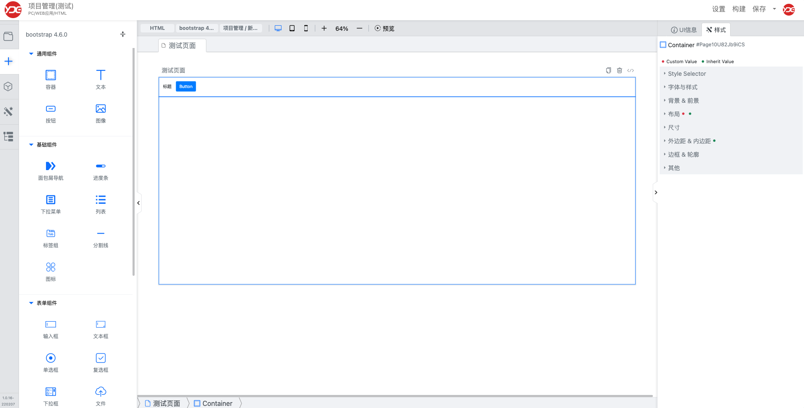

# YDUIBuilder

拖拽的方式编译生成前端代码。
目前能基于bootstrap生成web界面，并能编译生成最终前端代码。

## 项目组成

1. 下载的代码包含三个项目目录：ydevcloud，yduibuilder，snapshot
2. ydevcloud： 管理后端：
   1. 项目管理
   2. 编译生成UI代码
3. yduibuilder： 开发前端，拖拽市生成界面和设置属性
4. snapshot： 页面截屏工具 （可选）
5. ydevcloud/code/cli：socket服务，用与编译打包生成代码 （可选）

## 安装

### 准备
1. 本地需要安装php 7.4+环境并安装swoole、openssl、zip、xml、gd2扩展，
2. 安装mysql或者mariadb数据库
3. windows上php需要配置系统环境，以便在命令行能访问php.exe
4. 安装rabbitmq（可选，如果要生成页面截屏则安装）

### 安装yduibuilder
1. 这是一个vue3项目，用你的开发工具打开项目`yduibuilder`
2. 打开 src/lib/ydhl.ts，配置如下信息
   1. `api` 就是ydecloud管理后端的访问域名，也就是《安装ydecloud 管理后端》中的SITE_URI
   2. `uploadApi`就是《安装ydecloud 管理后端》中的UPLOAD_SITE_URI
   3. `socket`就是《安装ydecloud 管理后端》中的SOCKET_HOST
3. 进入到yduibuilder/yduibuilder目录后：`npm i`
4. 进入到yduibuilder/yduibuilder目录后：`npm run serve`
5. 默认情况 yduibuilder运行在9999端口上，如果有冲突，就修改package.json文件中scripts的对应设置，并修改《安装ydecloud 管理后端》中的UI_BUILDER_URI

### 安装ydecloud 管理后端
1. 初始化数据库: 导入`db_init.sql`创建数据库
2. 修改`ydevcloud/code/app/__config__.php`中的配置
   1. `YZE_DB_USER`： 用户名
   2. `YZE_DB_HOST_M`： 访问地址
   3. `YZE_DB_DATABASE`： 数据库名
   4. `YZE_DB_PORT`： 访问端口
   5. `YZE_DB_PASS`： 密码
   6. `SITE_URI`： 为你本地设置的虚拟域名
   7. `UPLOAD_SITE_URI`： 为上传文件的访问域名，该演示环境上传的文件都放到upload下，所以就是你的域名加 `upload/`
   8. `UI_BUILDER_URI`： yduibuilder前端的访问地址，如果没有端口冲突，则不用做更改
   9. `SOCKET_HOST`： socket后端的地址，如果没有端口冲突，则不用做更改
   10. RABBITMQ_HOST，RABBITMQ_PORT，RABBITMQ_USER，RABBITMQ_PWD：为rabbitmq的访问信息，根据本地部署情况填写
3. 配置管理后端的访问域名；管理后端基于yangzie php开发框架开发，单入口模式，需要配置一个虚拟域名，指向工作目录`ydevcloud/code/app/public_html`
4. 访问你配置的虚拟域名，如果能看到如下界面，则说明配置成功
5. 点击使用则直接使用，无需登录
6. 安装composer包：`composer install`
6. 访问你的域名，剩下的自己探索吧

### 安装socket服务

socket服务是用swoole写的，请先确保安装了对应的swoole扩展；进入到ydevcloud/code/cli中
运行 php build.php即可

### 安装截图服务（可选）

截图服务是snapshot，是nodejs开发
1. 用你的开发工具打开snapshot
2. `npm i`
3. 启动rabbitmq /usr/local/sbin/rabbitmq-server
4. 启动snapshot node --experimental-modules server.mjs
